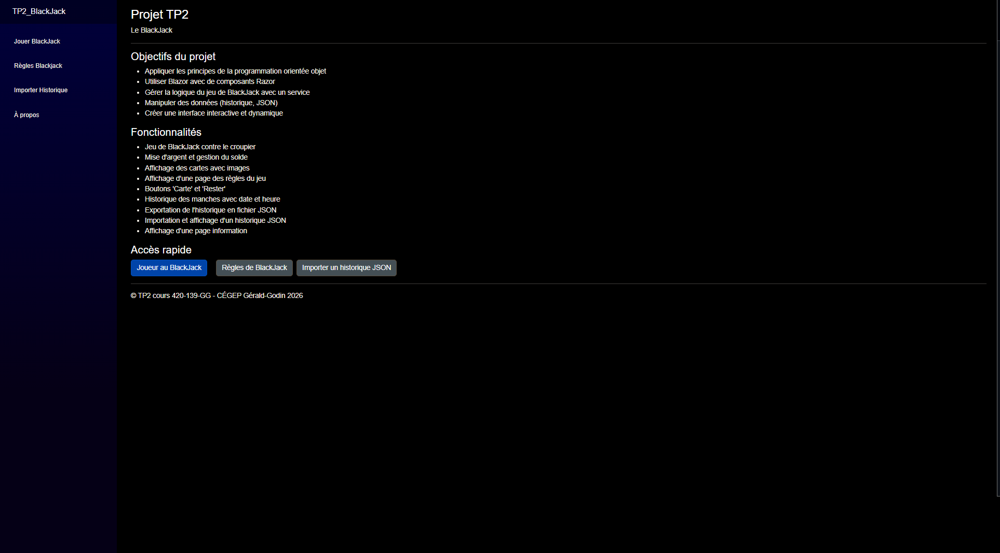
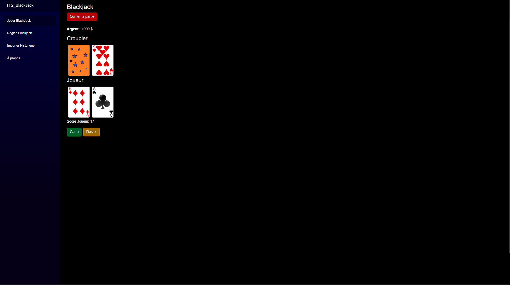
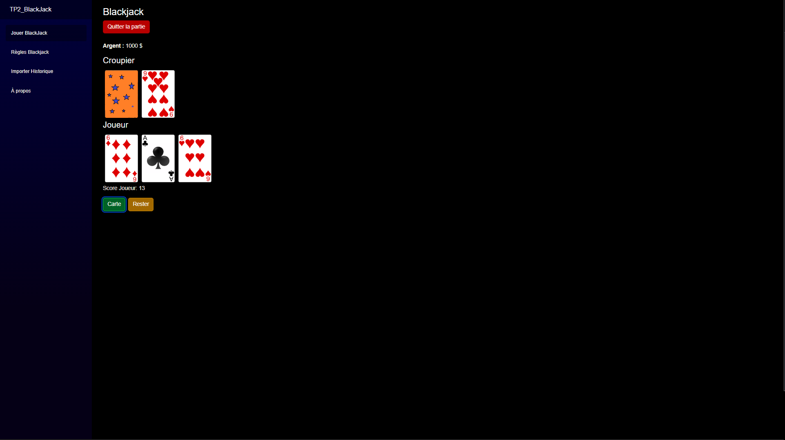
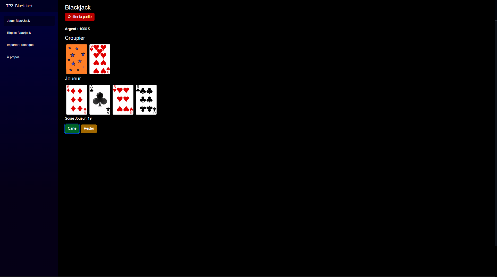
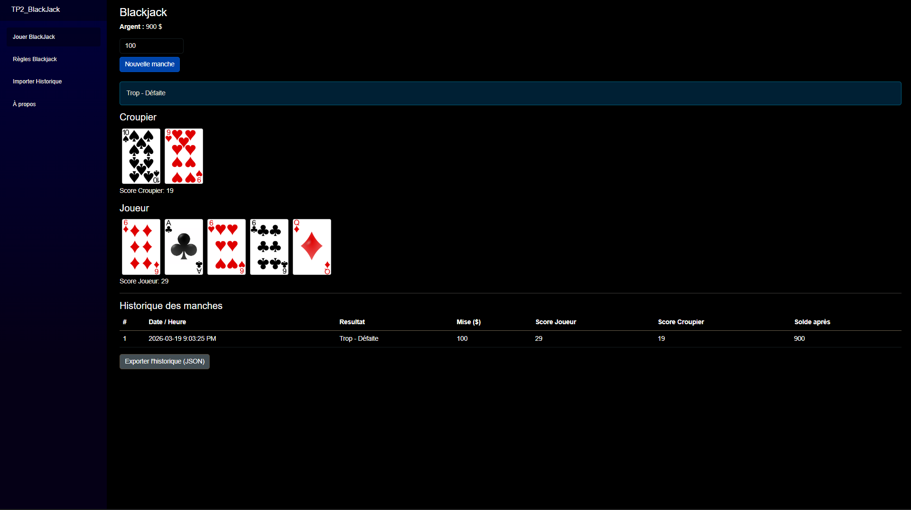
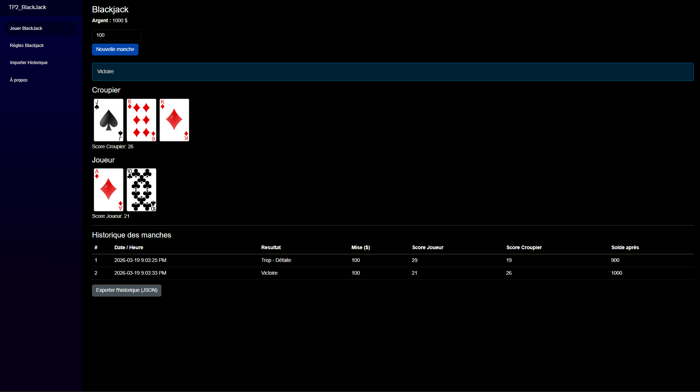
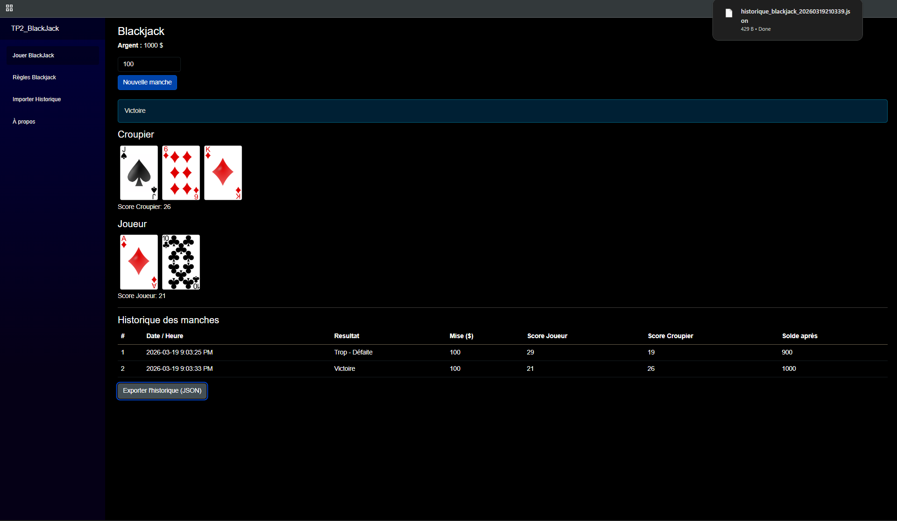
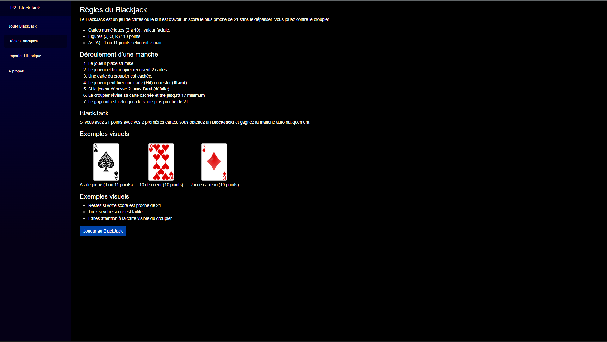
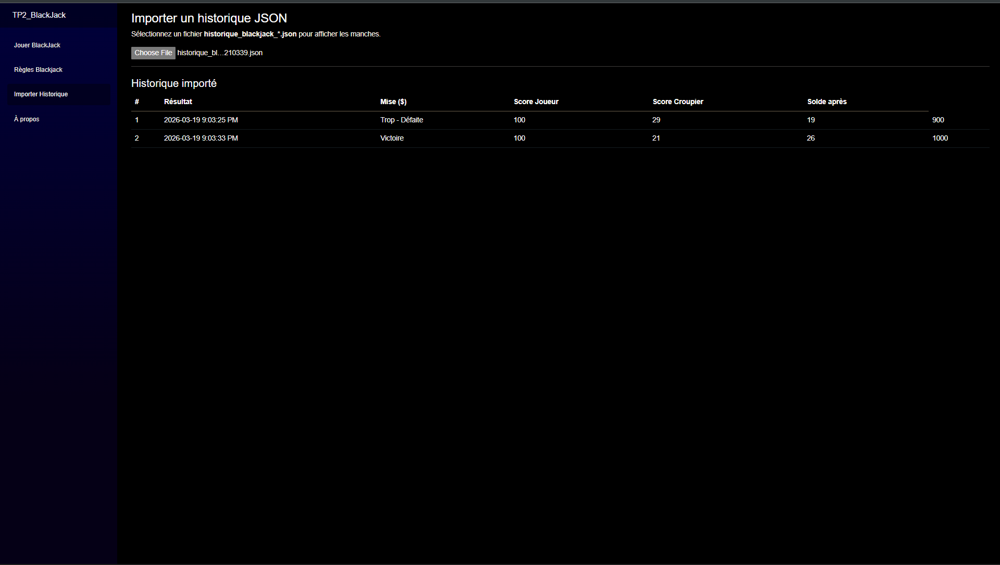
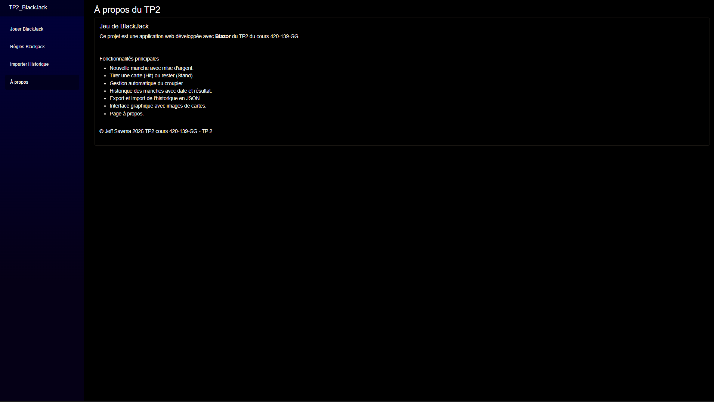

# Blackjack Web App

This is a Blackjack web application built using **Blazor and C#** as part of a school project.

The goal was to implement the full game logic while following a structured approach with a service handling the application state.

---

## Features

* Start a new round with a bet
* Draw cards or stay
* Dealer plays automatically (draws until reaching 17)
* Result is calculated at the end of each round
* Player balance updates after each game
* History of rounds is stored
* Export history to a JSON file
* Import a JSON file and display previous rounds

---

## Structure

The application is built around a service (`ServiceBlackJack`) that manages:

* The player and the dealer
* The deck of cards
* The current round state
* The history of all rounds

The UI is handled with Razor components and reacts to the state managed by the service.

---

## Tech

* C# (.NET 9)
* Blazor Server
* Razor Components
* Bootstrap

---

## Run the project

```bash
dotnet run
```

Then open:

http://localhost:5092

---

## Screenshots












